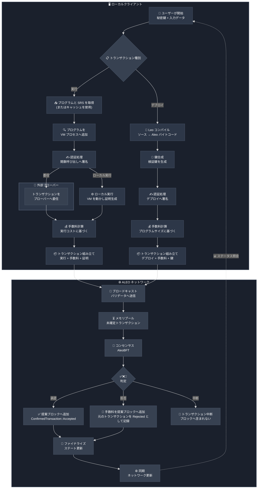

**トランザクション**は、新しいプログラムまたは一連の状態遷移を台帳へ公開するための基本的なデータ構造です。
Aleo では、ユーザーが自分の Aleo 秘密鍵（オンチェーンアカウントに対応）を用いてローカルからトランザクションを発行します。
発行には [Leo CLI](https://github.com/ProvableHQ/leo)、[Provable SDK](https://docs.explorer.provable.com/docs/sdk/92sd7hgph3ggt-overview)、[Puzzle Wallet SDK](https://docs.puzzle.online/) などのツールを利用できます。

## トランザクションの種類

### 実行トランザクション
実行トランザクションは、Aleo プログラムの関数呼び出しを表します。以下は実行トランザクションのレスポンス構造です。

|    パラメーター     |  型  |                                   説明                                    |
|:----------------:|:------:|:--------------------------------------------------------------------------------:|
|      `type`      | string |                        トランザクション種別（`execute`）                         |
|       `id`       | string | トランジション ID のマークル木ダイジェストから計算されるトランザクション ID |
|   `execution`    | object |                          実行トランザクション情報                          |
|       `fee`      | object |                          実行トランザクションの手数料                           |

#### execution オブジェクトの内容

|      パラメーター      | 型  |                            説明                            |
|:-------------------:|:-----:|:-----------------------------------------------------------------:|
| `global_state_root` |  u16  |             マークル木のグローバルステートルート              |
|    `transitions`    | array |              [トランジション](./04_transitions.md) の配列               |
|       `proof`       | string|                   実行のゼロ知識証明                       |

#### トランザクションとトランジションの関係

- **トランザクション**は、1 つの操作全体を表すトップレベルの単位です。**トランジション**は、トランザクション内の個々の状態変化を表す下位の要素です。
- **トランザクション**には複数の**トランジション**が含まれる場合があります。トランザクションの一部である Execution には、複数のトランジションがまとめて含まれます。
- **トランザクション**はクロスプログラム呼び出しが複数発生するケースでは複数の**トランジション**を保持します。

**トランジション**の詳細は [Transitions](./04_transitions.md) を参照してください。

#### Leo CLI を用いた実行トランザクションの作成

**必須情報:**
- プログラム ID（デプロイ済みプログラム名）
- 実行する関数名
- 関数への引数
- ネットワーク ID（`testnet` または `mainnet`）
- 呼び出し元の秘密鍵（またはプロジェクトディレクトリの .env に記載）

**任意パラメータ:**
- ブロードキャストフラグ（ネットワークへ送信するかどうか）
- プライベート手数料
- 優先手数料

### デプロイトランザクション
デプロイトランザクションは、Aleo プログラムをネットワークへ公開します。

|  パラメーター   |  型  |                                   説明                                    |
|:------------:|:------:|:--------------------------------------------------------------------------------:|
|    `type`    | string |                         トランザクション種別（`deploy`）                         |
|     `id`     | string | トランジション ID のマークル木ダイジェストから計算されるトランザクション ID |
|   `owner`    | object |                         所有者アドレスと署名                          |
| `deployment` | object |                         デプロイトランザクション情報                          |
|    `fee`     | object |                          デプロイトランザクションの手数料                          |

#### deployment オブジェクトの内容

|      パラメーター      | 型  |                            説明                            |
|:-------------------:|:-----:|:-----------------------------------------------------------------:|
| `global_state_root` |  u16  |             マークル木のグローバルステートルート              |
|    `transitions`    | array |              [トランジション](./04_transitions.md) の配列               |

#### デプロイトランザクションの作成

**必須情報:**
- Aleo instructions へコンパイル済みの Leo プログラム
- ネットワーク ID（`testnet` または `mainnet`）
- デプロイ実行者の秘密鍵（またはプロジェクトディレクトリの .env に記載）

**任意パラメータ:**
- プライベート手数料
- 優先手数料

### 手数料トランザクション
手数料トランザクションは、処理に対して支払われるネットワーク手数料を表します。拒否されたトランザクションは、ブロック内で「rejected」として確定扱いで記録されます。その際、手数料を確実に徴収するために、新しいトランザクション ID を持つ正当な手数料トランザクションが生成されます。通常の成功ケースでは、手数料は実行またはデプロイトランザクション内のトランジションオブジェクトとして記録されます。 

| パラメーター |  型  |                                   説明                                    |
|:---------:|:------:|:--------------------------------------------------------------------------------:|
|  `type`   | string |                          トランザクション種別（`fee`）                           |
|   `id`    | string | トランジション ID のマークル木ダイジェストから計算されるトランザクション ID |
|   `fee`   | object |                           拒否されたトランザクションに紐づく手数料                           |

トランザクション手数料は、トランザクションのサイズと、バリデータが実行する処理の複雑さに基づいて算出されます。手数料は Aleo クレジットのレコードを用いて公開または秘匿で支払えます。
詳細は [トランザクション手数料](./03A_transaction_fees.md) を参照してください。 

## トランザクションライフサイクル

<div align="center">



</div>

## トランザクションステータスの判定

Aleo のバリデータによって処理されたトランザクションは、次のいずれかの状態になります。

| ステータス | 説明 |
|:------:|:------------|
| `accepted` | デプロイまたは実行が成功し、対応する手数料が消費されました。トランザクションには確定済み ID が付きます。 |
| `rejected` | デプロイまたは実行ロジックが失敗しました。バリデータは手数料を独立した手数料トランザクションとして処理します。元のトランザクションは未確定 ID のままですが、手数料トランザクションには確定 ID が付きます。 |
| `aborted` | デプロイ/実行ロジックと手数料処理の両方が失敗しました。トランザクションは中断されます。 |

:::note
ネットワークが混雑している場合、バリデータがメモリプールから選択しなかったトランザクションはブロックへ含まれない場合があります。
:::

### 方法 1: ブロックからトランザクションを解析する

次の API で取得したブロックを処理することで、トランザクションステータスを判別できます。  

- `GET /<network>/block/{height}` — snarkOS ノードのエンドポイント
- Provable Explorer の [Get block by height or hash](https://docs.explorer.provable.com/docs/api-reference/8sqnes7uvwe05-get-block-by-height-or-hash)

ブロックレスポンスからトランザクションステータスを判定する手順は以下のとおりです。

#### 承認 (`accepted`) トランザクション
- `echo response | jq .transactions` でトランザクション一覧を取得する
- トランザクション JSON に `"status": "accepted"` が含まれている
- トランザクション ID は `echo transaction | jq .transaction.id` で確認できる

#### 拒否 (`rejected`) トランザクション
- `echo response | jq .transactions` でトランザクション一覧を取得する
- トランザクション JSON に `"status": "rejected"` が含まれている
- 確定済みトランザクション ID は `echo transaction | jq .transaction.id` で確認できる
- 連動する未確定トランザクション ID は以下のいずれかで取得する
  - `GET /<network>/unconfirmed/{confirmed id}` を呼び、`echo transaction | jq .transaction.id` を実行
  - `https://api.explorer.provable.com/v1/mainnet/transaction/unconfirmed/{ID}` を利用する

#### 中断 (`aborted`) トランザクション
- `echo response | jq .aborted_transaction_ids` で中断されたトランザクション ID の一覧を取得する

#### SDK - getConfirmedTransaction

```javascript
import { AleoNetworkClient } from '@provablehq/sdk/mainnet.js';

const net  = new AleoNetworkClient('https://api.explorer.provable.com/v1');   
const txId = 'at14v8nt94d7xmsp3dq2glpzft6xw3x42ne753mlt8uenn8zw76dsqqc65jnf';                                

const status = await net.getConfirmedTransaction(txId);
console.log(status.status);
```

### 方法 2: トランザクションステータスを直接問い合わせる

トランザクションの状態を直接確認する場合は以下のエンドポイントを利用します。

- `GET /<network>/transaction/confirmed/{transaction id}` — 同期済み snarkOS ノードの REST エンドポイント
- Provable Explorer の [Get transaction by ID](https://docs.explorer.provable.com/docs/api-reference/bqly6ukna97b6-get-transaction-by-id)

トランザクションが承認された場合、`echo $transaction | jq .type` は `"execute"` を返します。  
拒否された場合は `"fee"` を返します。
:::note
トランザクションが中断されたかどうかを即座に確認する API エンドポイントは現在提供されていません。
:::

確定済みトランザクション ID が分かっている場合、以下で含まれるブロックを特定できます。

- `GET /<network>/find/blockHash//{transaction id}` — 同期済み snarkOS ノードの REST エンドポイント
- Provable Explorer の [Get block hash for transaction ID](https://docs.explorer.provable.com/docs/api-reference/8ka85a1oq8iau-get-block-hash-for-transaction-id)

#### SDK - fetchData と getBlockByHash

```javascript
import { AleoNetworkClient } from '@provablehq/sdk/mainnet.js';

const net  = new AleoNetworkClient('https://api.explorer.provable.com/v1');   
const txId = 'at14v8nt94d7xmsp3dq2glpzft6xw3x42ne753mlt8uenn8zw76dsqqc65jnf'; 
// Get block hash using fetchData
const res = await net.fetchData('/find/blockHash/' + txId);   
// Get block by using getBlockByHash 
const block = await net.getBlockByHash(res)
// Get block height by response json
console.log(block.header.metadata.height);
```

### transfer_public / transfer_public_as_signer 実行から送信者アドレスを抽出する

送信者アドレスはユーザー所有の EOA（Externally Owned Account）の場合と、Aleo プログラムのアドレスの場合があります。

トランザクションの送信者アドレスは、最初の出力の第一引数に含まれます。以下のコマンドで、最初の出力に含まれる公開値を読みやすい文字列で取得できます。

```bash
echo $transaction | jq '.execution.transitions[0].outputs[0].value'
```

残念ながら、現時点の snarkOS および Explorer の REST エンドポイントは実行結果を JSON と互換性のない文字列で返します。そのため、最初の値を抽出する必要があります。送信者アドレスは正規表現、もしくは次のように 5 行目を抜き出すことで取得できます。

```bash
echo $(echo $transaction | jq '.execution.transitions[0].outputs[0].value') | sed -n '5p'
```

### ブロック内容の概要

ブロックには確定済みトランザクションが含まれます。

確定済みトランザクションは `accepted` または `rejected` のステータス、`deploy` または `execute` のタイプを持ち、`transaction` オブジェクトと任意の `rejected` オブジェクトを含みます。

- `transaction` は `fee` / `execute` / `deploy` のいずれかのタイプを持ちます。
- `rejected` は `execution` または `deployment` のタイプを持ちます。

```json
{
  …,
  "transactions": [
    "status": "accepted"/"rejected"
    "type": "deploy"/"execute",
    "transaction": {
      …,
      "type": "fee"/"execute"/"deploy"
    }
 "rejected": {
      …,
      "type": "execution"/"deployment"
    } 
  ],
  "unconfirmed_transaction_ids": [...]
}
```
