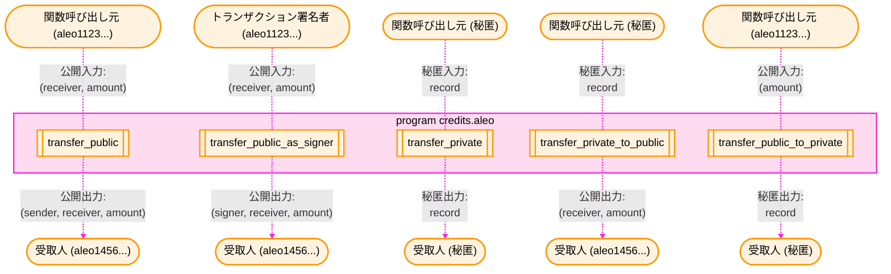
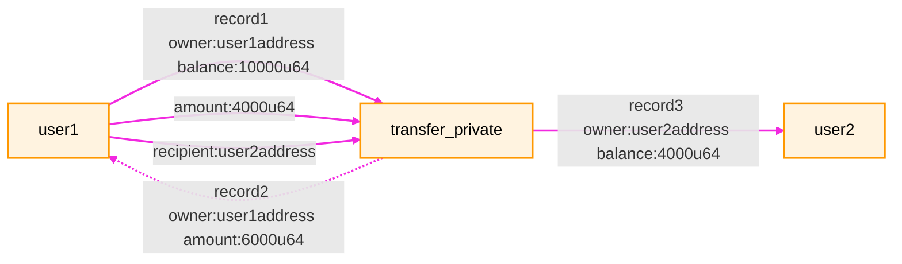
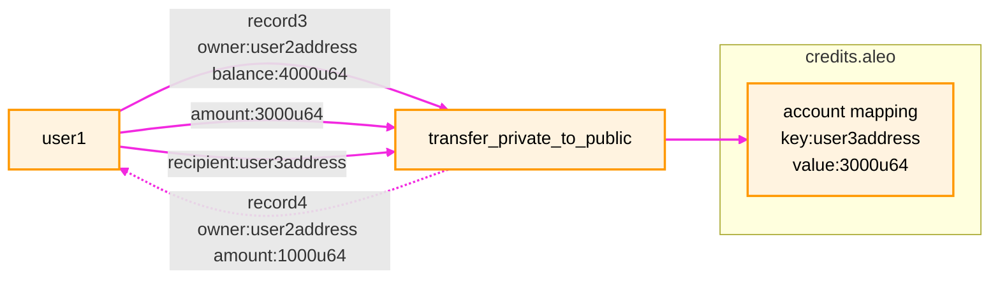
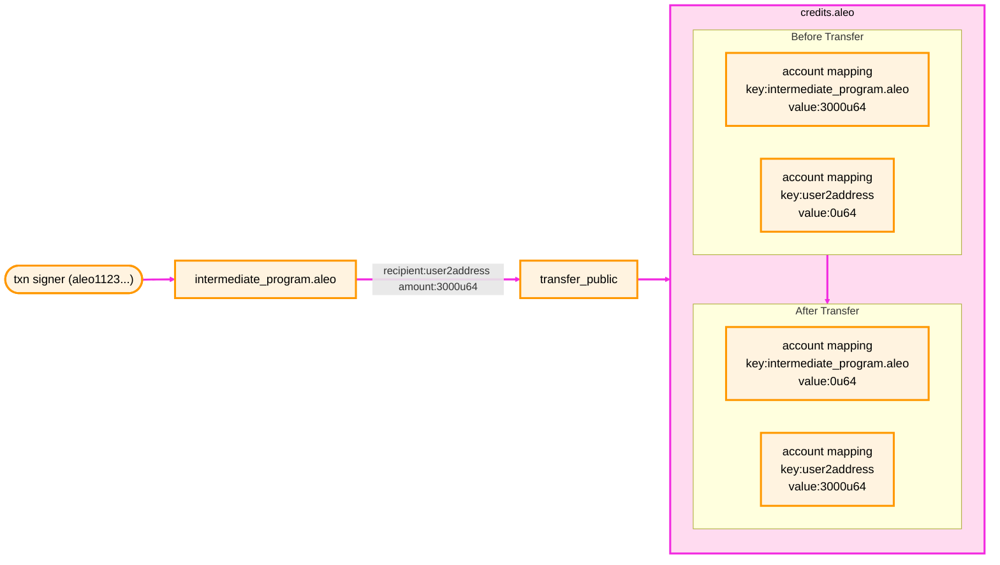
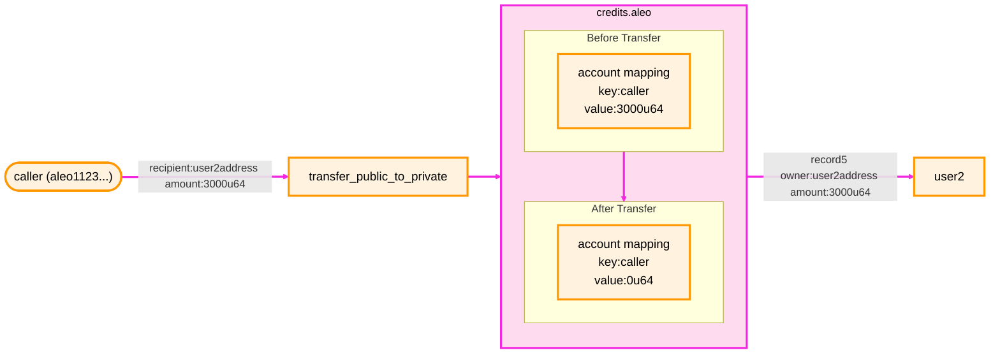
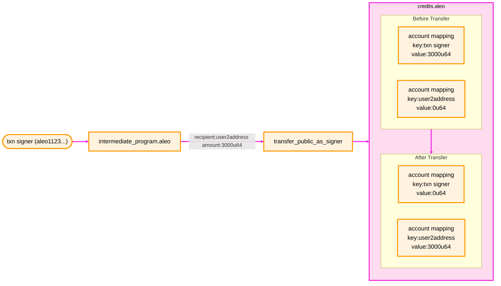

## 概要

Aleo ネットワークの公式通貨は Aleo クレジットです。トランザクション手数料の支払い、ステーキングおよびマイニング報酬の受け取りはすべて Aleo クレジットで行われます。

Ethereum のような一般的なブロックチェーンとは異なり、Aleo には特別な `transfer` トランザクションタイプは存在しません。その代わりに、[`credits.aleo`](https://explorer.provable.com/program/credits.aleo) というネイティブプログラムがクレジットの送金・利用・所有権を管理します。Aleo ネットワーク上での価値移転は、`Execute` トランザクションを通じて `credits.aleo` プログラムの関数を呼び出すことで行われます。これにより、クレジットを秘匿・公開・ハイブリッドの形で送金できるほか、ステーキングなど高度なオンチェーン操作も実行できます。

Aleo クレジットには credit と microcredit の 2 種類の単位があり、最小単位は 1 microcredit（credit の 0.000001）です。`credits.aleo` プログラムの関数パラメータは microcredit 単位で指定します。単位換算は [Aleo クレジットの単位表](../fundamentals/03A_transaction_fees.md#aleo-credits-denomination-table)を参照してください。

同じ `credits.aleo` プログラムにはステーキング関連の関数とステートも含まれます。ステーキング機能の詳細は [Staking](../network/staking.md) をご覧ください。

以下は `credits.aleo` で利用できる送金関数の一部を図示したものです。



:::note
**関数呼び出し元とトランザクション署名者の違い**
- **関数呼び出し元**: 現在の関数を直接呼び出した主体。中間プログラムやコントラクトの場合もあります。
- **トランザクション署名者**: 呼び出しチェーンに何段階あっても、トランザクション全体を開始した元の署名者です。
:::

:::warning[important]
レコードを扱う秘匿送金では、**秘密鍵で管理されるアカウントアドレス**を受取人に指定する必要があります。理由は以下のとおりです。

- レコードは受取人の公開鍵で暗号化され、対応する秘密鍵でしか復号できない
- プログラムアドレスはハッシュから導出されるため秘密鍵を持たず、レコードを復号できない
- **レコードをプログラムアドレスへ送信すると永久にアクセス不能になる**

秘匿送金やレコードを伴う操作では、必ずユーザーのアカウントアドレスを受取人に指定してください。
:::

## 公開/秘匿クレジット

Aleo クレジットを保有する方法は大きく 2 つあります。

### `credits` レコードによる秘匿残高
1 つ目は `credits` レコードを所有して秘匿残高を保持する方法です。
```aleo
record credits:
    owner as address.private;
    microcredits as u64.private;
```

ユーザーの秘匿残高は、`microcredits` が 0 でない未使用の `credits` レコード（UTXO に相当）の合計です。ウォレットはユーザーのレコードをチェーンから取得し、消費済みかどうかを判断して秘匿残高や秘匿トランザクション履歴を算出します。

### `account` マッピングによる公開残高
2 つ目は、`credits.aleo` プログラム内の `account` マッピングに残高を保持する方法です。`account` はオンチェーンのキー・バリューストアで、バリデータが各ブロックで更新します。公開残高は誰でも閲覧でき、Ethereum のアカウント残高と同様のモデルです。

```aleo
mapping account:
    key owner as address.public;
    value microcredits as u64.public;
```

公開残高はユーザーアドレスに対応する `account` の値となり、秘匿残高と公開残高を同時に保有できます。

## Aleo クレジットの送金

`credits.aleo` には 5 種類の送金関数が用意されています。

### `transfer_private`

送信者が所有する `credits` レコードから金額を差し引き、受取人に宛てた新しいレコードを生成します。100% 秘匿であり、`account` マッピングには影響しません。

**入力パラメータ**
- `credits.record` — 送信者のクレジットレコード
- `address.private` — 受取人アドレス（秘匿）
- `u64.private` — 送金額（microcredit, 秘匿）



### `transfer_private_to_public`

送信者の `credits` レコードを秘匿入力として消費し、受取人の `account` マッピングに公開残高として加算します。半分秘匿・半分公開の処理です。

**入力パラメータ**
- `credits.record` — 送信者のクレジットレコード
- `address.public` — 受取人アドレス（公開）
- `u64.public` — 送金額（microcredit, 公開）



### `transfer_public`

`credits.aleo` の `account` マッピングから送信者の公開残高を減算し、受取人の公開残高へ加算します。完全公開でレコードは発生しません。

**入力パラメータ**
- `address.public` — 受取人アドレス（公開）
- `u64.public` — 送金額（microcredit, 公開）



:::note
更新されるマッピングキーは `intermediate_program.aleo` であり、これはこの送金における「送信元」アドレスであってトランザクション署名者ではありません。
:::

### `transfer_public_to_private`

`credits.aleo` の `account` マッピングから公開残高を減算し、受取人が所有する新しい秘匿レコードを生成します。公開入力を消費し秘匿出力を生成する半公開・半秘匿の処理です。

**入力パラメータ**
- `address.private` — 受取人アドレス（秘匿）
- `u64.public` — 送金額（microcredit, 公開）



:::note
更新されるマッピングキーは `transfer_public` と同様に、関数を呼び出した主体（中間プログラムではなく現在の呼び出し元）です。
:::

### `transfer_public_as_signer`

`transfer_public` と同様に公開残高を移動させますが、送信元に関数呼び出し元ではなくトランザクション署名者のアドレスを使用します。常に元の署名者が「送信元」となる点が異なります。完全公開でレコードは発生しません。

**入力パラメータ**
- `address.public` — 受取人アドレス（公開）
- `u64.public` — 送金額（microcredit, 公開）



:::note
更新されるマッピングキーはトランザクション署名者であり、中間プログラムのアドレスではありません。
:::

:::tip
プログラムは `transfer_public_as_signer` を利用してユーザーから自分自身へ資金を受け取り、その後 `transfer_public` を使って資金をユーザーへ戻す、といったフローを構築できます。
:::
<!-- 
## Leo code examples

### Transfer from transaction signer

#### Transfer to current program as public balance

```leo
program example.aleo {
    async transition transfer_from_txn_signer(amount: u64) -> Future {
        let f: Future = credits.aleo/transfer_public_as_signer(THIS_PROGRAM_ADDRESS, amount);
        ... // Other logic
    }
}
```

#### Transfer to target address as public balance

```leo
program example.aleo {
    async transition transfer_from_txn_signer(receiver: address, amount: u64) -> Future {
        let f: Future = credits.aleo/transfer_public_as_signer(receiver, amount);
        ... // Other logic
    }
}
```

### Transfer from current program

#### Transfer to receiver as public balance

```leo
program example.aleo {
    async transition transfer_from_this_program(receiver: address, amount: u64) -> Future {
        let f: Future = credits.aleo/transfer_public(receiver, amount);
        ... // Other logic
    }
}
```

#### Transfer to receiver as private balance

```leo
program example.aleo {
    async transition transfer_from_this_program(receiver: address, amount: u64) -> (credits.aleo/credits, Future) {
        let (r, f): (credits.aleo/credits, Future) = credits.aleo/transfer_public_to_private(receiver, amount);
        ... // Other logic
    }
}
```

## Transferring with SDK

All five of these functions can be used to transfer credits between users via the `transfer` function in the
`ProgramManager` by specifying the transfer type as the third argument.

For more infomation regarding the SDK, please refer [here](https://docs.explorer.provable.com/docs/sdk/92sd7hgph3ggt-overview).

```typescript
import { Account, ProgramManager, AleoKeyProvider, NetworkRecordProvider, AleoNetworkClient } from '@provablehq/sdk';

// Create a new NetworkClient, KeyProvider, and RecordProvider
const account = Account.from_string({privateKey: "user1PrivateKey"});
const networkClient = new AleoNetworkClient("https://api.explorer.provable.com/v1");
const keyProvider = new AleoKeyProvider();
const recordProvider = new NetworkRecordProvider(account, networkClient);

// Initialize a program manager with the key provider to automatically fetch keys for executions
const myAddress = account.address();
const programManager = new ProgramManager("https://api.explorer.provable.com/v1", keyProvider, recordProvider);
programManager.setAccount(account);

// Send a private transfer to yourself
const tx_id = await programManager.transfer(1, myAddress, "transfer_private", 0.2);

// Update or initialize a public balance in your own account mapping
const tx_id_2 = await programManager.transfer(1, myAddress, "transfer_private_to_public", 0.2);

// Check the value of your public balance
let public_balance = programManager.networkClient.getMappingValue("credits.aleo", myAddress);
assert(public_balance === 0.2*1_000_000);

/// Send public transfer to another user
const USER_2_ADDRESS = "user2Address";
const tx_id_3 = await programManager.transfer(1, USER_2_ADDRESS, "transfer_public", 0.1);

// Check the value of the public balance and assert that it has been updated
public_balance = programManager.networkClient.getMappingValue("credits.aleo", myAddress);
const user2_public_balance = programManager.networkClient.getMappingValue("credits.aleo", USER_2_ADDRESS);
assert(public_balance === 0.1*1_000_000);
assert(user2_public_balance === 0.1*1_000_000);

/// Send public transfer as signer to another user
const tx_id_3a = await programManager.transfer(1, USER_2_ADDRESS, "transfer_public_as_signer", 0.1);

/// Create a private record from a public balance
const tx_id_4 = await programManager.transfer(1, myAddress, "transfer_public_to_private", 0.1);

// Check the value of the public balance and assert that it has been updated
public_balance = programManager.networkClient.getMappingValue("credits.aleo", myAddress);
assert(public_balance === 0);
```
-->
