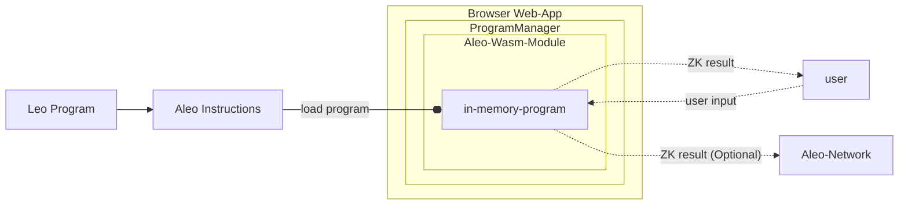

## プログラム実行モデル

SDK を使うと、Aleo Instructions のプログラムをブラウザ内で完結するクライアントサイド処理として実行できます。

`ProgramManager` オブジェクトはプログラムの実行およびゼロ知識証明の生成をひとまとめに提供します。内部的には、[snarkVM](../../guides/aleo/00_aleo_overview.md) を WebAssembly へコンパイルした暗号ライブラリを利用しています。WebAssembly への JavaScript バインディングを通じて、ブラウザだけでゼロ知識の実行が完結し、インターネットとの追加通信は必要ありません。より低レベルな仕組みに興味がある場合は、[aleo-wasm](https://github.com/ProvableHQ/sdk/tree/mainnet/wasm) クレートを参照してください。

基本的な実行フローは次のとおりです。
1. Web アプリが `ProgramManager` オブジェクトのインスタンスを読み込みます。
2. `Aleo Instructions` 形式の Aleo プログラムを wasm オブジェクトとして `ProgramManager` に読み込みます。
3. Web アプリがプログラムに入力するフォームをユーザーへ提供します。
4. ユーザーが入力を送信すると、ゼロ知識実行が WebAssembly 内でクライアントサイド実行されます。
5. 結果がユーザーへ返されます。
6. （任意）実行の完全に暗号化されたゼロ知識トランスクリプトを Aleo ネットワークへ送信します。

プログラム実行の流れは次の図でも表せます。


## プログラムの実行

一般的な実行トランザクションを構築する主なメソッドは `execute()` と `buildExecutionTransaction()` の 2 つです。`execute()` はトランザクションを構築すると同時に Aleo ネットワークへ送信し、`buildExecutionTransaction()` はトランザクションを構築して JavaScript へ返すだけです。

それでは具体例を見ながら進めましょう。  

### セットアップ

[プログラムのデプロイ](./03_deploy_programs.md) ガイドと同様に、まだであれば基本となるオブジェクトを初期化します。

```typescript
import { Account, AleoNetworkClient, initThreadPool, ProgramManager, AleoKeyProvider } from '@provablehq/sdk';

// スレッドプールが未初期化の場合はここで初期化します（別の場所で初期化済みなら省略可能）。
await initThreadPool();

const account = new Account({ privateKey: 'APrivateKey1...'});
const networkClient = new AleoNetworkClient("https://api.explorer.provable.com/v1");

const keyProvider = new AleoKeyProvider();
keyProvider.useCache = true;

const programManager = new ProgramManager(networkClient, keyProvider);
programManager.setAccount(account);
```
上記のコードについて不明点があれば、前章を参照して詳細を確認してください。

### トランザクションの構築
上記セットアップに加えて、メモリキャッシュに格納されている証明鍵・検証鍵を見つけるために、キー検索パラメーターを定義しておくと便利です。
```typescript
const keySearchParams = { cacheKey: "betastaking.aleo:stake_public" };
```

すべての初期化が完了したら、トランザクションを構築して送信し、結果を待ちます。
```typescript
// プログラムをインラインで指定したオプションを使って実行し、トランザクションを取得します。
const tx = await programManager.buildExecutionTransaction({
    programName: "betastaking.aleo",
    functionName: "stake_public",
    fee: 0.10,
    privateFee: false, // Assuming a value for privateFee
    inputs: ["aleo17x23al8k9scqe0qqdppzcehlu8vm0ap0j5mukskdq56lsa25lv8qz5cz3g", "50000000u64"], // Example inputs matching the function definition
    keySearchParams: keySearchParams,
});

// プログラムをネットワークへ送信します。
const transaction_id = await programManager.networkClient.submitTransaction(tx);

// 通常、トランザクションがネットワークで確定するまでに 1〜3 ブロック（3〜9 秒）かかります。
// その頃合いになったら、次の関数でトランザクションの詳細を取得します。
const transaction = await programManager.networkClient.getTransaction(transaction_id);
```

別の方法として、`execute()` を呼び出してトランザクションの構築とブロードキャストを 1 回で実行させることもできます。

```typescript
const transaction_id = await programManager.execute(
    programName: "betastaking.aleo",
    functionName: "stake_public",
    fee: 0.10,
    privateFee: false, // Assuming a value for privateFee
    inputs: ["aleo17x23al8k9scqe0qqdppzcehlu8vm0ap0j5mukskdq56lsa25lv8qz5cz3g", "50000000u64"], // Example inputs matching the function definition
    keySearchParams: keySearchParams,
);

const transaction = await programManager.networkClient.getTransaction(transaction_id);
```


## ローカルでのプログラム実行

トランザクションを Aleo ネットワークへ送信せず、ローカルでプログラムを実行することも可能です。これは、ブロックチェーン外で Aleo の zkSNARK を利用したい場合や、開発中にプログラムのテスト実行を行いたい場合に役立ちます。この用途のために、`ProgramManager` クラスにはローカル実行用の `run()` メソッドが用意されています。

### 証明を生成せずにローカル実行する場合
証明の生成という計算コストの高い処理を省き、関数の出力だけ確認したいときは `ProgramManager` の `run()` メソッドを使用できます。引数としてプログラム、関数名、関数への入力を渡すだけです。

この方法では証明を生成せずにプログラムを実行し、関数の出力を返します。開発中の関数をテストする場合に便利です。

```typescript
import { Account, ProgramManager } from '@provablehq/sdk';

/// "hello world" プログラムのソースを作成します
const program = "program helloworld.aleo;\n\nfunction hello:\n    input r0 as u32.public;\n    input r1 as u32.private;\n    add r0 r1 into r2;\n    output r2 as u32.private;\n";
const programManager = new ProgramManager();

/// プログラム実行用の一時アカウントを作成します
const account = new Account();
programManager.setAccount(account);

/// レスポンスを取得し、プログラムが正しく実行されたか確認します
const executionResponse = await programManager.run(program, "hello", ["5u32", "5u32"]);
const result = executionResponse.getOutputs();
assert.deepStrictEqual(result, ['10u32']);
```


### 証明を生成しながらローカル実行する場合
プログラム実行の証明を生成しつつ Aleo ネットワークには送信したくない場合は、`run()` メソッドの `proveExecution` パラメーターを true に設定します。これにより、実行時の証明を含む `ExecutionResponse` オブジェクトが作成され、関数の証明鍵・検証鍵を持つ任意の人が `verifyExecution()` メソッドでオフチェーン検証できます。

:::note
非同期 Future を定義している関数では、この方法は機能しません。
:::

```typescript
import { Account, AleoKeyProvider, ProgramManager, ProvingKey, VerifyingKey } from '@provablehq/sdk';

/// キープロバイダーとネットワーククライアントを初期化します。
const networkClient = new AleoNetworkClient("https://api.explorer.provable.com/v1");
const keyProvider = new AleoKeyProvider();
keyProvider.useCache = true;

/// プログラムを定義します。
const program = "program helloworld.aleo;\n\nfunction hello:\n    input r0 as u32.public;\n    input r1 as u32.private;\n    add r0 r1 into r2;\n    output r2 as u32.private;\n";

/// プログラムの証明鍵と検証鍵を作成してキープロバイダーに保存します。
const provingKey = ProvingKey.fromString("...");
const verifyingKey = VerifyingKey.fromString("...");
keyProvider.cacheKeys("helloworld.aleo:main", [provingKey, verifyingKey]);

/// キープロバイダーを使って ProgramManager を作成します。
const programManager = new ProgramManager(networkProvider, KeyProvider);

/// プログラム実行用の一時アカウントを作成します
const account = new Account();
programManager.setAccount(account);

/// レスポンスを取得し、プログラムが正しく実行されたか確認します
const executionResponse = await programManager.run(
  program: program, 
  function_name: "hello", 
  inputs: ["5u32", "5u32"], 
  proveExecution :true, 
  keySearchParams: {"cacheKey":"helloworld.aleo:main"},
  
);

/// 実行証明を検証します
const proofIsValid = await programManager.verifyExecution(executionResponse);
```


