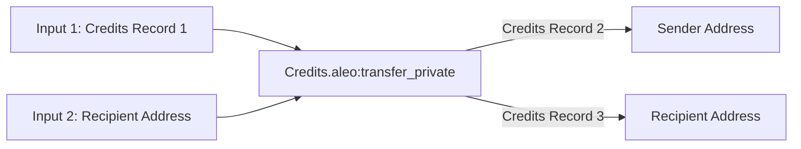

## 公開状態: マッピング
マッピングはプログラム内で定義されたシンプルなキーと値のストアです。キーと値はそれぞれ指定された型で表現され、Aleo ブロックチェーンに直接保存されます。Aleo ネットワークの参加者であれば誰でも公開状態として参照できます。

マッピングの利用例として、`credits.aleo` プログラムの `account` マッピングがあります。このマッピングは、オンチェーン上の公開 Aleo クレジット残高をすべて保持します。

```leo
mapping account:
    key owner as address.public;
    value microcredits as u64.public;
```


### マッピングの初期化と更新
マッピングを更新するには、Aleo ネットワーク上でファイナライズブロックを持つプログラム関数を実行し、そのファイナライズブロックがマッピングを更新します。たとえば `credits.aleo` プログラムの `transfer_public` 関数は、呼び出されると `account` マッピング（つまりユーザーの残高）を更新します。

```leo
// ユーザーが呼び出す公開インターフェース
function transfer_public:
    input r0 as address.public;
    input r1 as u64.public;
    finalize self.signer r0 r1;

// Aleo ネットワーク上のノードが実行し、ユーザーの公開残高を更新するファイナライズブロック
finalize transfer_public:
    input r0 as address.public;
    input r1 as address.public;
    input r2 as u64.public;
    get.or_use account[r0] 0u64 into r3;
    sub r3 r2 into r4;
    set r4 into account[r0];
    get.or_use account[r1] 0u64 into r5;
    add r5 r2 into r6;
    set r6 into account[r1];
```

API の呼び出し側から見ると、通常の Aleo 関数を実行するのと同じように簡単です。SDK での実行方法については、[プログラムの実行](./04_execute_programs.md) ガイドや [クレジットの送金](./05_transfer_credits.md) ガイドを参照してください。

マッピングを更新するファイナライズスコープを持つ関数に対し、入力が有効であれば、Aleo ネットワークによってマッピングが初期化または更新されます。入力が無効な場合はネットワークがエラーを返しますが、支払ったトランザクション手数料は消費されます。そのため、関数を実行する前に入力が有効であることを確認することが重要です。


### マッピングの読み取り
プログラムのマッピングに含まれる状態はすべて公開されており、Aleo ネットワークの参加者なら誰でも読み取れます。`AleoNetworkClient` クラスには、プログラム内の公開マッピングを取得する `getProgramMappingNames()` メソッドと、マッピング内の特定のキーに対応する値を取得する `getProgramMappingValue()` メソッドが用意されています。

```typescript
import { AleoNetworkClient } from '@provable/sdk';

const networkClient = new AleoNetworkClient("https://api.explorer.provable.com/v1");
const creditsMappings = networkClient.getProgramMappingNames("credits.aleo");
assert(creditsMappings === ["committee", "delegated", "metadata", "bonded", "unbonding", "account", "withdraw"]);

//<ADDRESS> = 残高が 0 の有効な Aleo アカウント
const publicCredits = networkClient.getProgramMappingValue("credits.aleo", "<ADDRESS>");
assert(publicCredits === "0u64");
```


## 秘匿状態: レコード
レコードは [UTXO](https://en.wikipedia.org/wiki/Unspent_transaction_output) の概念に似ています。プログラムでレコードが生成されると、同じプログラムが後で関数の入力として消費できます。一度入力として使われたレコードは消費済みとみなされ、再利用できません。多くの場合、関数の出力から新しいレコードが生成されます。レコードは既定で秘匿であり、特定の Aleo プログラムとユーザーを表す 1 つの秘密鍵に結び付けられます。詳細は基本概念の [レコード](../../concepts/fundamentals/02_records.md) セクションを参照してください。

### レコードの探索
レコードの探索は、Bitcoin における UTXO の探索と似ています。レコードは実行トランザクションに含まれるトランジションの出力として保存されます。レコードを見つけるために、Web アプリの実装者は次の手順を踏む必要があります。

1. レコードを含むトランジションを持つトランザクションを Aleo ネットワーク上でスキャンします。
2. 見つかったレコードが目的のユーザーに属しているか確認します。
3. レコードがどこかの関数入力に登場しているかを確認し、「消費済み」か「未使用」かを判別します。
4. 必要に応じてレコードを復号し、内部のデータを取得します。

`AleoNetworkClient` はレコード探索用に `findRecords()` メソッドを提供します。このメソッドでは、指定したブロック高の範囲でレコードを検索できます。

さらに必要に応じて、次のような条件を指定できます。

- 未使用レコードのみを対象にするかどうか。
- レコードを検索したいプログラムを 1 つ以上指定する。
- 検索対象から除外したいノンス（レコードの一意な ID）のリスト。

`credits.aleo` のレコードを検索する場合は、以下も指定できます。
- 探したい金額のリスト。
- レコード全体で探す合計金額の上限。

```typescript
import { Account, AleoNetworkClient } from '@provablehq/sdk';

const account = new Account({ privateKey: 'APrivateKey1...'});
const networkClient = new AleoNetworkClient("https://api.explorer.provable.com/v1");
networkClient.setAccount(account);

// Find all records from an account within a block range.
const allRecords = networkClient.findRecords(
    4370000, // Start block height
    4371000, // End block height
    false, // Find both spent and unspent records.
    ["credits.aleo", "token_registry.aleo"], // Find records for the credits.aleo and token_registry.aleo programs.
);

// Find only unspent records from an account within a block range that can be used as inputs to new functions.
const unspentRecords = networkClient.findRecords(
    4370000, // Start block height
    4371000, // End block height
    true, // Find both spent and unspent records.
    ["credits.aleo", "token_registry.aleo"], // Find records for the credits.aleo and token_registry.aleo programs.
)

```
このメソッドは指定されたブロック範囲を線形に検索します。比較的小さなブロック範囲で目的のレコードが見つかる見込みがある場合に最も有効です。大きなブロック範囲では、この方法は現実的でない場合があります。
<!-- 
### `RecordProvider` インターフェースの実装
実行時にレコードを効率よく見つけるには、`RecordProvider` の実装が利用できます。このインターフェースによって、開発者は新しいレコードを探す効率的な戦略を実装できます。`RecordProvider` インターフェースのデフォルト実装は `NetworkRecordProvider` クラスですが、開発者は独自の検索戦略を実装することも可能です。

`ProgramManager` オブジェクトのコンストラクターに `RecordProvider` が渡され、関数実行時に `RecordSearchParameters` と秘匿手数料が指定されている場合、`ProgramManager` は手数料の支払いに適したレコードを自動的に検索します。

以下は、`RecordProvider` インターフェースの `NetworkRecordProvider` 実装を使用した例です。

```typescript
import { Account, AleoNetworkClient, AleoKeyProvider, NetworkRecordProvider, ProgramManager } from '@provablehq/sdk';

const account = new Account({ privateKey: 'APrivateKey1...'});

// 公式の Aleo 実装を使って NetworkClient、KeyProvider、RecordProvider を作成します
const networkClient = new AleoNetworkClient("https://api.explorer.provable.com/v1");
networkClient.setAccount(account);

const keyProvider = new AleoKeyProvider();
keyProvider.useCache = true;

const recordProvider = new NetworkRecordProvider(account, networkClient);

// 実行時に鍵を自動取得するよう、ProgramManager をキープロバイダー付きで初期化します
const programManager = new ProgramManager("https://api.explorer.provable.com/v1", keyProvider, recordProvider);
programManager.setAccount(account);

// 送金に利用するレコードを見つけます
let recordSearchParameters = {
    programs: ["credits.aleo"], // Find records for the credits.aleo program.
    amounts: [10_000_000], // Find the amount desired to be transferred.
    startHeight: 4370000, // Specify the start of a block range where unspent records are likely to be found.
    endHeight: 4371000, // Specify the end of a block height range where unspent records are likely to be found.
}
const record = await programManager.recordProvider.findRecords(
    true, // Find only unspent records.
    undefined, // No nonces need to be excluded because only one record is being searched for.
    recordSearchParameters,
);
// 見つかったレコードのノンスを記録し、再度選択されないようにします
const nonce = record.nonce();

// トランザクション手数料の支払いに使うレコードを探します
const feeRecordSearchParameters = {
    programs: ["credits.aleo"], // Find records for the credits.aleo program.
    amounts: [40_000], // Find the amount desired to be transferred.
    startHeight: 4370000, // Specify the start height.
    endHeight: 4371000, // Specify the end height.
    nonces: [nonce], // Exclude the nonce of the record found for the transfer.
}

const transaction = await programManager.buildExecutionTransaction({
  programName: "credits.aleo",
  functionName: "transfer_private",
  fee: 0.040,
  privateFee: true,
  inputs: [record, "10000000u64"],
  recordSearchParams: feeRecordSearchParameters, // Specify the record search parameters for the fee record.
});

const result = await programManager.networkClient.submitTransaction(transaction);
```
 -->
#### レコード探索の最適化
ブロックチェーン全体の履歴を走査するといった単純な手法は時間がかかり、Web アプリのユーザー体験を損なう可能性があります。幸い、より効率的にするための戦略があります。

#### ユーザーのアカウント作成後のみを検索する
ユーザーが既知のブロック以降に Aleo アカウントを作成した場合、そのブロック高以降のレコードのみをスキャンすることで検索を最適化できます。

#### 特定プログラムのレコードに絞って検索する
探しているレコードが特定のプログラムに属しているのであれば、そのプログラムのレコードだけをスキャンすることで検索を効率化できます。

#### Web アプリで作成したレコードを保存する
Web アプリがトランザクションを生成した場合、そのトランザクションから生成されたレコードへアクセスできます。後で簡単に取り出せるようにデータベースへ保存しておきましょう。

### レコードの復号
ユーザーがプログラム実行から秘匿レコードを受け取った場合、SDK を使ってビュ―キーで暗号化されたレコードを復号し、その内容を確認できます。復号できるのはユーザー自身が所有するレコードのみです。ユーザーが所有していないレコードを復号しようとすると失敗します。

レコードの復号と所有者の確認は、次のコードで行えます。
```typescript
import { Account, RecordCiphertext, RecordPlaintext } from '@provablehq/sdk';

// 既存の秘密鍵からアカウントを作成します
const account = Account.from_string({privateKey: "existingPrivateKey"});

// プログラムの出力または Aleo ネットワークから取得したレコード文字列
const record = "record1qyqsq4r7mcd3ystjvjqda0v2a6dxnyzg9mk2daqjh0wwh359h396k7c9qyxx66trwfhkxun9v35hguerqqpqzqzshsw8dphxlzn5frh8pknsm5zlvhhee79xnhfesu68nkw75dt2qgrye03xqm4zf5xg5n6nscmmzh7ztgptlrzxq95syrzeaqaqu3vpzqf03s6";

const recordCiphertext = RecordCiphertext.fromString(record);

// レコードの所有者を確認します。アカウントが所有者であればレコードを復号します
if (RecordCiphertext.is_owner(account.viewKey())) {
   // アカウントのビューキーでレコードを復号します
   const recordPlaintext = recordCiphertext.decrypt(account.viewKey());

   // レコードのデータを表示します
   console.log(recordPlaintext.toString());
}
```


### レコードの利用

SDK を使えば、先ほどの `RecordPlaintext` 型を利用して関数の入力や秘匿手数料の支払いに使いたいレコードを明示的に指定できます。ここでは具体例として、`credits.aleo` の `transfer_private` 関数を見ていきましょう。

`transfer_private` 関数は次のグラフのように表現できます。


この関数は秘匿の `credits` レコードを入力として消費し、出力として 2 つの新しい秘匿 `credits` レコードを生成します（一方は受取人へクレジットを送り、もう一方は残額を送信者へ返します）。以下は、この流れを SDK で実装した例です。

#### ユーザー 1 がユーザー 2 へ秘匿送金する
[クレジットの送金](./05_transfer_credits.md) ガイドを読んでいれば、次の例は見覚えがあるはずです。
```typescript
// USER 1
import { Account, ProgramManager, AleoKeyProvider, NetworkRecordProvider, AleoNetworkClient } from '@provablehq/sdk';

// NetworkClient、KeyProvider、RecordProvider、ProgramManager を作成します
const USER1 = new Account({privateKey: "APrivateKey1..."});
const networkClient = new AleoNetworkClient("https://api.explorer.provable.com/v1");
const keyProvider = new AleoKeyProvider();
const recordProvider = new NetworkRecordProvider(USER1, networkClient);
const programManager = new ProgramManager("https://api.explorer.provable.com/v1", keyProvider, recordProvider);
programManager.setAccount(USER1);

/// ユーザー 2 へ秘匿送金します。入力レコードを指定しない場合、NetworkRecordProvider が残高の十分な credits.aleo レコードを自動的に見つけます
const USER2_ADDRESS = "aleo1...";
const tx_id = await programManager.transfer(1, USER2_ADDRESS, "transfer_private", 0.2);
```

#### ユーザー 2 がユーザー 1 へ秘匿送金を返す

`transfer_private` のような実行がレコードを消費または生成すると、トランザクションは暗号化されたレコード出力としてオンチェーンに投稿されます。投稿時にレコードは暗号化されているため、プログラムを実行した当事者やレコードの内容は明らかになりません。公開されるのはプログラム ID、関数名、暗号化された関数入力、トランザクション ID だけです。レコードの受取人以外のユーザーはレコード内容を確認できません。

したがって、ユーザーがネットワークからレコードを取得して関数の入力として使用したい場合は、まず秘密鍵またはビュ―キーを用いて復号し、平文に変換する必要があります。次のコードがその手順を示します。

```typescript
// USER 2
import { Account, ProgramManager, AleoKeyProvider, NetworkRecordProvider, AleoNetworkClient, RecordCiphertext } from '@provablehq/sdk';

// ユーザー 2 用に NetworkClient、KeyProvider、RecordProvider、ProgramManager を作成します
const USER2 = new Account({privateKey: "APrivateKey1..."});
const networkClient2 = new AleoNetworkClient("https://api.explorer.provable.com/v1");
const keyProvider2 = new AleoKeyProvider();
const recordProvider2 = new NetworkRecordProvider(USER2, networkClient2);
const programManager2 = new ProgramManager("https://api.explorer.provable.com/v1", keyProvider2, recordProvider2);
programManager2.setAccount(USER2);

// ユーザー 1 が送信したトランザクションをネットワークから取得します
const transaction = await programManager2.networkClient.getTransaction(tx_id);
const record = transaction.execution.transitions[0].outputs[0].value;

// ユーザー 2 のビューキーでレコードを復号します
const recordCiphertext = RecordCiphertext.fromString(record);
const recordPlaintext = recordCiphertext.decrypt(USER2.viewKey());

// 復号したレコードを使ってユーザー 1 へ秘匿送金を行います
const USER1_ADDRESS = "aleo1...";
const tx_id2 = await programManager2.transfer(1, USER1_ADDRESS, "transfer_private", 0.2, undefined, recordPlaintext);
```


